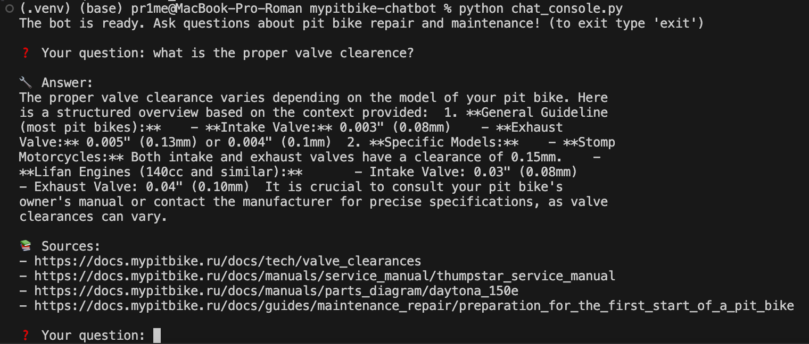

# MyPitbike RAG Chatbot

MyPitbike RAG Chatbot is a chat application designed to assist users with questions related to pit bike maintenance and repair. Utilizing DeepSeek-R1 model and FAISS vector storage, the chatbot delivers precise answers to specific technical queries.

## Features

- **Interactive Chatbot**: Engages users by answering questions about pit bike maintenance.
- **FAISS Vector Store**: Efficient storage and retrieval of pre-processed documents.
- **Extensive Document Support**: Handles a wide range of document input formats, extracting relevant context to formulate responses.
- **Modular Architecture**: Built using Langchain and Together.ai, providing flexibility and scalability.
- **Knowledge Base Integration**: Sources knowledge from the MyPitbike knowledge base documents found in the repository [djpr1me/mypitbike](https://github.com/djpr1me/mypitbike).

## Usage

- **Chat Console**: Interact with the bot through a command-line chat interface.
- **Ask Questions**: Type your queries into the console and receive answers with links to relevant documentation.



## How to Start

To run the MyPitbike RAG Chatbot locally, follow these steps in two separate terminal windows:

1. **Start the Ollama Server:**

   In the first terminal window, execute the command to start the Ollama server. This will make the local embedding service available:

   ```bash
   ollama serve
   ```

2. **Run the Console Chat Bot:**

   Open a second terminal window and run the following command to interact with the chat bot:

   ```bash
   python chat_console.py
   ```

   Enter questions in the console to receive answers. To exit the chat bot, type `exit` in the question field.